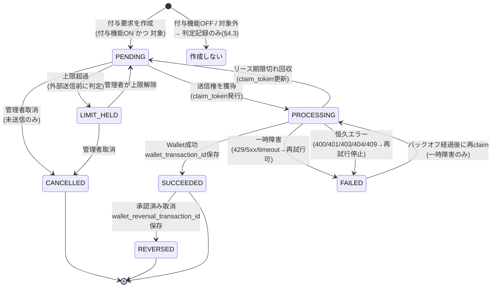

# PR5-a 実装計画書（rev.2）— Wallet送信の基盤

- 作成日: 2026-08-22
- 対象: `stockbusiness/sengokugacha`（Passport）
- 準拠: 2026-08-22 のご指示1〜7、「千ノ国パスポート × OVEW Wallet 次工程実装指示書」§5・§6
- 起点: `main` = `792f2bd`
- 前版: `docs/PR5A_WALLET_SEND_FOUNDATION_PLAN_20260822.md`（ご指示4・7を反映して全面改訂）
- **本計画の承認、および C6 の結論が出るまで、コード変更・マイグレーション作成・Feature Flag変更・外部送信・デプロイは行いません。**

---

## 1. 現在のコードとDBの再確認結果

### 1.1 Wallet 側仕様の確定（ご指示1）

**8/20 に記録した内容が正で、8/22 指示書の A-1（`common_user_id` 第一候補）は誤りでした。** ご指示1により次で確定します。

| 項目 | 確定内容 |
|---|---|
| 利用者解決 | **`service_code` + `external_user_id`** |
| `common_user_id` | 付与APIでは**使わない** |

Wallet 側の未確定・未実装（回答待ち、§12）: 正式な `external_user_id`、学習ミッション専用の取引種別、`rule_code`、取引照会API/CSV、`service_integrations`・scope・上限、staging 接続情報と運用手順。

### 1.2 既存テーブルの実測（コードから確認）

`learning_journey_reward_requests` の現行列は次のとおりです（`20260815000001`）。

| 既にある | 型・制約 |
|---|---|
| `id` / `completion_event_id`（unique） / `user_id` | uuid |
| **`external_user_id`** | `text not null`。「作成時点で確定させ、以後書き換えない」とコメント済み |
| `common_user_id` | `text`（記録用・NULL可） |
| `amount` | `integer not null check (amount >= 0)` |
| `completion_source` | `ANSWERED` / `SELF_REPORTED` |
| **`status`** | **7状態の CHECK 制約**（ご指示4のとおり維持） |
| `idempotency_key` | `text not null unique` |
| `wallet_transaction_id` / `wallet_reversal_transaction_id` | text |
| `attempt_count` / `last_error` / `sent_at` | — |

**既に `external_user_id` を NOT NULL で持ち、作成時点で確定させる設計になっています。** ご指示1の方式と噛み合っており、列の作り直しは不要です。

### 1.3 不足している列（claim / fencing / 指示書§5.1）

既存 outbox（`20260809000008`）が持つ3列が、付与要求テーブルには**ありません**。

| 不足列 | 用途 |
|---|---|
| `claim_token uuid` | fencing token |
| `lease_expires_at timestamptz` | リース期限（タイムアウト回収の基準） |
| `next_retry_at timestamptz` | バックオフ |
| `last_attempted_at timestamptz` | 指示書§5.1「最終試行時刻」 |
| `wallet_error_code text` | 指示書§5.1「エラーコード」 |
| `request_id text` | 指示書§5.1「request_id」 |

**いずれも追加型で足します。既存列は変更しません。**

なお `status` の CHECK には `dead` 相当がありません。既存 outbox は上限到達で `dead` へ落としますが、**付与要求では `FAILED`（自動再試行停止）で表現します**（ご指示4により状態を増やさないため）。再試行の可否は `attempt_count` と `next_retry_at` で判定します。

### 1.4 完了イベント側

`learning_journey_completion_events` は `id` / `enrollment_id` / `mission_id` / `content_version_id` / `completion_source` / `completed_at` / `unique(enrollment_id, mission_id)` のみで、**付与判定の記録場所がありません**（§4.3 で新設）。

### 1.5 DB の実データ確認（マイグレーション作成前に実施）

**まだ実行していません。** ご指示のとおり read-only で再確認してから着手します。

```sql
select json_build_object(
  '付与要求_全件',   (select count(*) from learning_journey_reward_requests),
  '付与要求_状態別', (select json_agg(json_build_object('status', status, 'count', c))
                      from (select status, count(*) as c
                            from learning_journey_reward_requests group by status) s),
  '完了イベント',    (select count(*) from learning_journey_completion_events),
  '受講登録',        (select count(*) from learning_journey_enrollments),
  'コース',          (select count(*) from learning_journey_courses),
  'ミッション',      (select count(*) from learning_journey_missions),
  'フラグ',          (select row_to_json(s) from (
                        select missions_enabled, rewards_enabled,
                               consultation_sync_enabled, line_notifications_enabled
                        from learning_journey_settings limit 1) s)
) as 事前確認;
```

**期待値**: すべて0件、フラグ行なし（コード既定で全OFF）。**0件でなければマイグレーションを作らず、一度ご相談します。**

---

## 2. 変更予定ファイル

| # | ファイル | 変更 | 種別 |
|---|---|---|---|
| 1 | `supabase/migrations/20260819000001_wallet_send_foundation.sql` | 新規。列追加6本＋判定テーブル1本＋claim/mark関数3本 | 追加型のみ |
| 2 | `src/lib/expected-migrations.ts` | version 1行追加 | — |
| 3 | `src/modules/learning-journey/domain/wallet-contract.ts` (+test) | 新規。契約型・エラー分類 | 純粋 |
| 4 | `src/modules/learning-journey/domain/reward-state-machine.ts` (+test) | 新規。状態遷移 | 純粋 |
| 5 | `src/modules/learning-journey/domain/reward-idempotency.ts` (+test) | 新規。冪等性キー生成 | 純粋 |
| 6 | `src/modules/learning-journey/domain/reward-decision.ts` (+test) | 新規。付与するか否かの判定 | 純粋 |
| 7 | `src/modules/learning-journey/infrastructure/fake-wallet-adapter.ts` (+test) | 新規。Fake アダプタ | — |
| 8 | `src/lib/learning-journey-reward-dispatch.ts` | 新規。claim → Fake送信 → 結果反映 | — |
| 9 | `src/modules/wallet-send-guards.test.ts` | 新規。構造テスト | — |

**HTTPアダプタのファイルは作りません。** PR5-b です。

---

## 3. 状態遷移図



**この図に `REWARD_DISABLED` / `DEFERRED_DECISION` は現れません**（ご指示4）。付与要求が作られる前の判定なので、送信状態機械の外側です。

**`LIMIT_HELD` は `PENDING` から直接決まり、`PROCESSING` を経由しません**（指示書§2「LIMIT_HELDは外部送信前に判定し、上限保留中の要求をoutboxへ投入しない」）。

### 3.1 遷移の実装方針

純粋関数として実装し、DB も HTTP も触りません。

```
transition(current: RewardRequestStatus, event: RewardEvent)
  -> { ok: true; next: RewardRequestStatus } | { ok: false; reason: string }
```

表にない遷移（例: `SUCCEEDED → PROCESSING`、`CANCELLED → PENDING`）は**すべて拒否**し、テストで固定します。

---

## 4. 付与要求を作るかどうかの判定（ご指示4）

### 4.1 付与機能OFF時は付与要求を作らない

指示書 禁止2（「付与OFF期間の完了を無条件に PENDING へ溜め、後日すべて自動送信してはいけない」）への対応です。**そもそも PENDING を作らなければ、後日一括送信という事故が起きません。**

### 4.2 判定の分岐

```
decideReward(context) ->
  | { decision: "REQUESTED";         amount: number }   // 付与要求を作る
  | { decision: "REWARD_DISABLED" }                     // 付与制度が無効
  | { decision: "DEFERRED_DECISION" }                   // 対象者・予算・方針が未決
  | { decision: "NOT_ELIGIBLE" }                        // 対象外(金額0等)
```

### 4.3 判定記録は別テーブルへ分離

```sql
create table if not exists learning_journey_reward_decisions (
  id uuid primary key default gen_random_uuid(),
  completion_event_id uuid not null unique
    references learning_journey_completion_events(id) on delete cascade,
  user_id uuid not null references users(id) on delete cascade,

  decision text not null check (decision in (
    'REQUESTED', 'REWARD_DISABLED', 'DEFERRED_DECISION', 'NOT_ELIGIBLE'
  )),
  reward_request_id uuid unique references learning_journey_reward_requests(id),

  -- 判定時点の根拠。後から設定が変わっても、当時なぜそう判定したかを追える。
  decided_amount integer not null default 0 check (decided_amount >= 0),
  decision_reason text,

  created_at timestamptz not null default now(),
  updated_at timestamptz not null default now()
);
```

**完了記録（`learning_journey_completion_events`）に列を足さない理由**: あちらは「学習が完了した」という事実の記録で、付与制度の状態とは寿命が違います。付与方針は今後何度も変わりますが、完了した事実は変わりません。混ぜると制度変更のたびに学習記録のスキーマを触ることになります。

### 4.4 後日付与の経路は、このPRでは作りません

ご指示4の6要件（対象者の再判定・予算確認・重複付与確認・管理者の明示承認・操作理由・監査ログ）について、**`REWARD_DISABLED` / `DEFERRED_DECISION` を `PENDING` へ変える経路そのものを実装しません。**

6要件を満たさない変更経路が先に存在すると、それが抜け道になります。経路を作るのは6要件を同時に実装できる段階（PR5-c 以降）です。**「無条件の一括遡及付与は禁止」を、機能の不在によって保証します。** 構造テストで固定します（§10.3）。

---

## 5. 冪等性キーの生成規則

### 5.1 付与

```
idempotency_key = `learning_journey_reward:{completion_event_id}`
```

- `completion_event_id` は `unique (enrollment_id, mission_id)` に紐づくため、**1利用者1ミッションにつき常に同じ値**になります
- 再送のたびに新しい値へ変えません（指示書§5.3 固定ルール）
- ランダム値・タイムスタンプを含めません

### 5.2 取消

```
reversal_idempotency_key = `learning_journey_reversal:{reward_request_id}:{approval_id}`
```

付与キーとは**別の名前空間**です。「元付与ID＋取消理由の承認レコード」から生成します（指示書§5.3）。同じ付与に対する2回目の取消申請は `approval_id` が変わるため別キーになり、**元取引の二重取消は Wallet 側の冪等性ではなく Passport 側の状態機械（`SUCCEEDED` からのみ `REVERSED` へ）で防ぎます。**

### 5.3 テスト

純粋関数として単体テストします（指示書§5.3「キー生成関数を純粋関数として単体テストする」）。同じ入力→同じ出力、異なる入力→異なる出力、付与キーと取消キーが衝突しないこと。

---

## 6. claim / fencing の方式

**既存の実績ある方式をそのまま踏襲します。** `20260809000008_outbox_atomic_claim_fencing.sql` の `claim_integration_outbox_event()` と同じ構造です。

### 6.1 Postgres 関数

```
claim_learning_journey_reward_request(p_id uuid, p_claim_token uuid,
                                      p_lease_seconds int default 300,
                                      p_max_attempts int default 10) returns text
```

戻り値: `claimed` / `not_found` / `already_sent` / `in_progress` / `not_eligible` / `not_due` / `dead`

処理順（既存と同一）:

1. `select ... for update` で行ロック
2. `SUCCEEDED` なら `already_sent`
3. `PROCESSING` かつ **`lease_expires_at > now()`** なら `in_progress` ← **二重送信防止の要**
4. `next_retry_at > now()` なら `not_due`（バックオフ中）
5. `attempt_count >= p_max_attempts` なら `FAILED`（自動再試行停止）
6. `PROCESSING` へ更新し、`claim_token` を発行、`lease_expires_at` を設定、`attempt_count` を +1

### 6.2 fencing

```
mark_learning_journey_reward_succeeded(p_id, p_claim_token, p_transaction_id) returns boolean
mark_learning_journey_reward_failed(p_id, p_claim_token, p_error_code, p_error) returns boolean
```

**更新条件に `claim_token = p_claim_token and status = 'PROCESSING'` を含めます。** これにより、リース期限切れで別 worker に再claimされた後、**古い worker が遅れて成功応答を返しても状態を上書きできません**（`row_count = 0` で `false` が返る）。

呼び出し側は `false` を「自分の claim は失効していた」と解釈し、**Wallet 取引IDを保存しません**。

---

## 7. 並列実行・再送・タイムアウト対策

| 事象 | 対策 |
|---|---|
| **並列実行** | 行ロック + `PROCESSING` かつリース有効なら `in_progress` を返す。**送信権を得る worker は常に1つ** |
| **再送** | 冪等性キーが決定論的（§5.1）。Wallet 側が同一キーで既存取引を返す |
| **タイムアウト** | リース期限（既定300秒）が切れた行は再claim可能。`claim_token` を**新しい値へ更新**する |
| **古い worker の復帰** | fencing により更新が0行になり、状態を上書きできない（§6.2） |
| **応答喪失** | 送信したが応答が返らなかった場合、リース切れ後に再claim → 同じ冪等性キーで再送 → Wallet が既存取引を返す → `SUCCEEDED` に収束 |
| **上限超過** | `PENDING` の段階で判定し、`LIMIT_HELD` へ。**外部送信もoutbox投入もしない** |
| **試行上限** | `attempt_count >= 10` で `FAILED`（自動再試行停止）。管理者確認へ回す |

### 7.1 リース期限の設計

既定 300 秒（既存 outbox と同じ）。**Vercel のサーバーレス関数実行時間上限より十分長く**取ります。関数が途中で打ち切られても、リースが切れるまでは他の worker が横取りしません。

---

## 8. Fake Wallet アダプタの仕様

`src/modules/learning-journey/infrastructure/fake-wallet-adapter.ts`

### 8.1 インターフェース

```
export interface WalletAdapter {
  grant(request: WalletGrantRequest): Promise<WalletGrantResult>;
  reverse(request: WalletReverseRequest): Promise<WalletReverseResult>;
}
```

**このPRで存在する実装は Fake だけです。** HTTP 実装は PR5-b。

### 8.2 利用者参照（ご指示1・3）

```
export type WalletUserRef = {
  kind: "external_user_id";
  serviceCode: string;
  externalUserId: string;
};
```

ご指示1で `service_code` + `external_user_id` に確定したため、**判別可能ユニオンをやめ、単一形に確定**しました（前版からの変更点）。`common_user_id` を送る型は**作りません**。

`externalUserId` の値は `learning_journey_reward_requests.external_user_id`（作成時に確定・以後書き換えない）から取ります。**Wallet 担当者が正式な `external_user_id` の採番を回答するまで、この値をどう作るかは決めません**（§12）。Fake はこの値を検証せず、そのまま受け取ります。

### 8.3 Fake が再現する挙動

| シナリオ | 応答 |
|---|---|
| 成功 | `{ ok: true, transactionId }` |
| **同一キー再送** | **同じ `transactionId` を返す**（Wallet の冪等性を模す） |
| **同一キー・異なる金額** | `{ ok: false, kind: "permanent", code: "conflict" }`（409相当） |
| 一時障害 | `{ ok: false, kind: "transient", code: "server_error" }` |
| タイムアウト | `Promise` が解決しない／専用エラー |
| **応答喪失** | 内部では取引を作るが、呼び出し側にはエラーを返す |
| 認証・権限 | `{ ok: false, kind: "permanent", code: "unauthorized" / "forbidden" }` |
| 上限 | `{ ok: false, kind: "limit", code: "limit_exceeded" }` |

**「応答喪失」の再現が重要**です。これがないと、二重付与が起きない保証をテストで示せません。

### 8.4 エラー分類の型（指示書§5.4）

```
export type WalletErrorKind =
  | "transient"   // 429 / 5xx / timeout → ジッター付き指数バックオフ
  | "permanent"   // 400 / 404 / 409     → FAILED。人手確認
  | "auth"        // 401 / 403           → 自動再試行停止 + 緊急通知
  | "limit";      // Wallet所定コード     → LIMIT_HELD または管理者確認
```

HTTP ステータスから `WalletErrorKind` への写像も純粋関数にし、指示書§5.4 の表をそのままテストにします。**PR5-b で HTTP アダプタを書くとき、この写像を再実装しなくて済みます。**

---

## 9. C6 との依存関係

### 9.1 依存の実体

PR5-a が**直接**依存するのは、`purchase_grant_steps` / outbox と同じ **claim/fencing の設計パターン**であって、`integration_outbox_events` テーブルそのものではありません。付与要求テーブルに同じ方式を実装します。

一方、**PR5-b 以降の実送信は cron による定期再送に依存します**。C6 が未解決のままだと、送信要求が滞留しても気付けません。

### 9.2 C6 の結論が PR5-a に与える影響

| C6 の原因 | PR5-a への影響 |
|---|---|
| **A** Vercel が発火していない | 設計に影響なし。運用設定の問題 |
| **B** 処理が落ちている | 設計に影響なし。ただし cron 修正が先 |
| **C** 監査ログの insert が黙って失敗 | **影響あり。** §9.3 |

### 9.3 C だった場合に見直す点

`logAdminAction()` は失敗しても例外を投げません（`console.error` のみ）。C が確定した場合、**PR5-a が残す監査ログも同じように失われる可能性**があります。

指示書§5.5 は「再実行・LIMIT_HELD解除・取消・後日付与への変更は manager 権限と操作理由を必須にする」としており、**その記録が消えるなら要件を満たしません**。C なら、PR5-a の設計に「監査ログの記録失敗を検知できる仕組み」を追加する必要があります。

**ご指示5のとおり、C6 の結論が出るまでコード実装に着手しません。**

---

## 10. 単体テストと並列テスト

### 10.1 単体（純粋関数）

| # | 内容 |
|---|---|
| 1 | 冪等性キーが `completion_event_id` から決定論的に生成される |
| 2 | 同じ入力から常に同じキー。再送でキーが変わらない |
| 3 | 取消キーが付与キーと衝突しない（名前空間が別） |
| 4 | 状態遷移表の全遷移が期待どおり |
| 5 | 表にない遷移が拒否される（`SUCCEEDED → PROCESSING`、`CANCELLED → PENDING` 等） |
| 6 | `LIMIT_HELD` が `PENDING` から直接決まり、`PROCESSING` を経由しない |
| 7 | HTTPステータス → `WalletErrorKind` の写像が指示書§5.4 の表と一致 |
| 8 | 判定関数が付与OFF時に `REWARD_DISABLED` を返す |
| 9 | 金額0のミッションが `NOT_ELIGIBLE` になる |
| 10 | 判定が `REQUESTED` 以外のとき、付与要求を作らない |

### 10.2 並列・再送・タイムアウト（指示書§6「単体・並列テスト成功」）

ローカル PostgreSQL 16 上で、実際の Postgres 関数に対して実行します。

| # | 内容 |
|---|---|
| 11 | **同じ要求を並列10実行しても、`claimed` を得るのは1つだけ** |
| 12 | 残り9つは `in_progress` を返す |
| 13 | リース期限切れ後は再claim でき、`claim_token` が**新しい値に変わる** |
| 14 | **古い `claim_token` での成功マークが `false` を返し、状態を変えない** |
| 15 | 古い worker の成功応答で `wallet_transaction_id` が上書きされない |
| 16 | `attempt_count` が上限に達すると `FAILED` になり、以後 claim されない |
| 17 | バックオフ期間中は `not_due` を返す |

### 10.3 契約テスト（Fake アダプタ）

| # | 内容 |
|---|---|
| 18 | 同一冪等性キーを10回送信 → Fake の取引は1件、全応答が同じ取引IDへ収束 |
| 19 | 同一キー・異なる金額 → `permanent` / `conflict` で拒否、新規取引を作らない |
| 20 | **応答喪失 → 再送 → 二重付与にならない**（Fake内部の取引が1件のまま） |
| 21 | タイムアウト後の再claim → 同じキーで再送 → `SUCCEEDED` に収束 |
| 22 | 上限応答 → `LIMIT_HELD`。外部送信を再試行しない |

### 10.4 構造テスト（PR-P1b / P1c と同じソース走査方式）

| # | 内容 |
|---|---|
| 23 | **Wallet へ HTTP 送信するコードが存在しない**（`fetch` の不在） |
| 24 | `users.id` を `externalUserId` に渡すコードが存在しない |
| 25 | メール・LINE ID から識別子を導出するコードが存在しない |
| 26 | `common_user_id` を Wallet 送信に使うコードが存在しない |
| 27 | **`REWARD_DISABLED` / `DEFERRED_DECISION` を `PENDING` へ変更する経路が存在しない** |
| 28 | `reward_requests.status` の CHECK が7状態のまま |
| 29 | Feature Flag の既定が OFF |
| 30 | 保存する列・ログに署名値・APIキー・トークンが含まれない |

**PR-P1b / P1c と同じく、主要なテストは意図的に壊して落ちることを確認**してから提出します。

---

## 11. ロールバック方法

| 手段 | 内容 |
|---|---|
| **第1** | `wallet_adapter` を `fake` に戻す（**既定が `fake`** なので、通常は何もしなくてよい） |
| **第2** | コードの revert |
| **データ** | 追加列・追加テーブルは削除しない。既存列・既存データを一切変更しないため復旧不要 |

**このPRは外部通信を行わないため、ロールバックで取り消すべき外部影響がありません。**

Feature Flag は `learning_journey_settings` に `wallet_adapter: 'fake' | 'http'`（既定 `fake`）を1つ足します。PR-P1b / P1c と同じくコード側ゲートも置き、DB だけでは `http` に切り替わりません。**このPRでは `http` を選んでもアダプタが存在しないため動きません。**

---

## 12. 今回実装しない範囲

| 項目 | 実施PR / 条件 |
|---|---|
| Wallet HTTP アダプタ | PR5-b（Wallet 回答後） |
| 署名・HMAC ヘッダー生成 | PR5-b |
| 実送信・Feature Flag の有効化 | 実施順序どおり（§13） |
| 本番APIキー・署名鍵の投入 | 同上 |
| 本番 scope 付与 | 同上 |
| 管理画面（絞り込み・CSV・再実行・停止・取消申請・照合差異） | PR5-c |
| 照合CSV | PR5-c（Wallet 側の取引照会API/CSV が前提） |
| staging 結合試験・runbook・Go/No-Go 資料 | PR5-d |
| `REWARD_DISABLED` / `DEFERRED_DECISION` → `PENDING` の変更経路 | PR5-c 以降（6要件を同時に実装できる段階） |
| 旧3,000 OVE の遡及付与 | 禁止（A-4 確定後、別途承認） |
| 未解決利用者への付与 | 禁止（common_user_id 解決後） |
| `external_user_id` の採番規則の確定 | Wallet 回答後（§13） |

---

## 13. Wallet 担当者の回答待ち項目

**すべて PR5-b 以降の前提です。PR5-a の着手には不要です。**

| # | 項目 | PR5-a への影響 | PR5-b への影響 |
|---|---|---|---|
| 1 | Passport から送る正式な `external_user_id`（採番規則） | なし（Fake は値を検証しない） | **必須** |
| 2 | 学習ミッション専用の取引種別 | なし | **必須** |
| 3 | 学習ミッション専用の `rule_code` | なし | **必須** |
| 4 | 取引照会API または CSV（実装済みか／提供時期／期間・`service_code`・`rule_code` で抽出可能か） | なし | PR5-c・照合に必須 |
| 5 | Passport 用 `service_integrations`・scope・上限設定 | なし | **必須** |
| 6 | staging 接続情報（URL・HMACヘッダー・時刻許容・nonce・キー発行/ローテーション手順） | なし | **必須** |
| 7 | 付与・取消・残高・取引照会の HTTP 例、エラーコード、再試行可否、タイムアウト値 | エラー分類の写像に反映 | **必須** |
| 8 | 回答の基準となるコミットSHAまたはリリース日 | なし | 前提の固定に必要 |

**秘密値そのものは受け取りません。** 発行方法・保管先・ローテーション手順・失効手順のみを確認します。

---

## 14. 本番 Go 条件への追加（ご指示3）

指示書§8 の判定項目に、次の3点を追加します。

| # | Go 条件 |
|---|---|
| 1 | **Wallet 付与APIで使用する正式な利用者識別子が確定している** |
| 2 | **対象利用者の `common_user_id` が解決済みである** |
| 3 | **重複・競合・誤紐付けが0件である** |

**現在、本番19名全員の `common_user_id` が未解決**のため、条件2を満たしていません。満たすまで Wallet 付与機能を OFF のまま維持します。

---

## 15. 実施順序（ご指示6）

`00_5SYSTEM_EXECUTION_ORDER` は**上書きしません**。PR5-a の準備工程だけを先行し、Wallet 実送信は次の完了後です。

C6 解決 → 5システム横断E2E → Agency 共通ID連携 → Wallet 利用者識別子の確定 → Wallet 照合手段の実装 → staging 接続準備 → 運営承認

**Feature Flag はすべて OFF のまま維持します。**

---

## 16. 前提条件と着手可否

| 前提 | 状態 |
|---|---|
| 本計画の承認 | **未取得** |
| **C6 の結論** | **未取得**。これが出るまでコード変更に着手しません（ご指示5） |
| §1.5 の事前確認（0件検証） | **未実施**。マイグレーション作成前に実施 |
| Wallet の A-1 / A-5 回答 | 未取得。PR5-a には不要（§13） |

## 17. 確認をお願いしたい点

| # | 内容 |
|---|---|
| 1 | 判定記録を新規テーブル `learning_journey_reward_decisions` に持つこと（§4.3） |
| 2 | `REWARD_DISABLED` / `DEFERRED_DECISION` → `PENDING` の変更経路を、このPRでは作らないこと（§4.4） |
| 3 | 上限到達を `dead` ではなく **`FAILED`（自動再試行停止）** で表すこと（§1.3。状態を増やさないため） |
| 4 | 取消の冪等性キーに `approval_id` を含めること（§5.2）。承認レコードの実体は PR5-c で作ります |
| 5 | `wallet_adapter` フラグを既存 `learning_journey_settings` に足すこと（§11） |
| 6 | §1.5 の事前確認が0件でなかった場合、マイグレーションを作らず相談すること |
| 7 | 指示書§9 の提出物一覧・§10 の完了報告テンプレートを PR 本文に含める形でよいか |

---

## 18. 作業範囲

本計画書の提出までです。**承認および C6 の結論が出るまで、以下は行いません。**

コード変更 / マイグレーション作成 / Feature Flag 変更 / 外部送信 / デプロイ / PR作成
